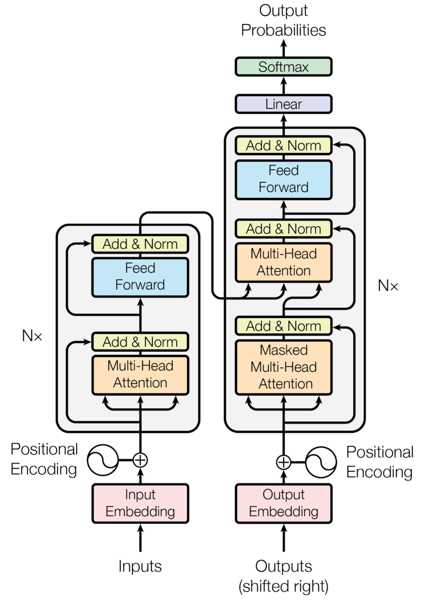

# Reverse Seqs

I have used the orignal transformer from [this](https://arxiv.org/pdf/1706.03762.pdf) research paper



# Hyperparameters
```python
VOCAB_SIZE = 13
SEQ_LEN = 10
D_MODEL = 512
NHEAD = 8
LEARNING_RATE = 1e-4
DROPOUT = 0.2
FFN_HID_DIM = 512 * 4
BATCH_SIZE = 32
NUM_ENCODER_LAYERS = 6
NUM_DECODER_LAYERS = 6
```

# Results
The trainned weights are huge, To be uploaded to cloud.
But, Let me tell this problem is not solved with this project

Note: `>` & `=` should be same...and... `<` should be a fliped version of `>`\
We've used `CrossEntropyLoss`

```python
> tensor([5, 4, 3, 2, 8, 1, 6, 7], device='cuda:0')
= tensor([5, 4, 5, 3, 3, 4, 8, 8], device='cuda:0')
< tensor([8, 8, 4, 3, 3, 5, 4, 5], device='cuda:0')

> tensor([8, 6, 5, 7, 3, 1, 2, 0], device='cuda:0')
= tensor([8, 6, 6, 6, 7, 8, 8, 8], device='cuda:0')
< tensor([8, 8, 8, 7, 6, 6, 6, 8], device='cuda:0')

> tensor([2, 9, 1, 5, 8, 0, 4, 3], device='cuda:0')
= tensor([2, 9, 9, 5, 9, 0, 0, 9], device='cuda:0')
< tensor([9, 0, 0, 9, 5, 9, 9, 2], device='cuda:0')

> tensor([4, 7, 1, 5, 2, 8, 3, 0], device='cuda:0')
= tensor([4, 7, 7, 5, 2, 7, 2, 7], device='cuda:0')
< tensor([7, 2, 7, 2, 5, 7, 7, 4], device='cuda:0')

> tensor([6, 7, 2, 4, 9, 3, 0, 5], device='cuda:0')
= tensor([6, 7, 2, 2, 2, 9, 9, 7], device='cuda:0')
< tensor([7, 9, 9, 2, 2, 2, 7, 6], device='cuda:0')

> tensor([1, 7, 5, 6, 8, 9, 4, 0], device='cuda:0')
= tensor([1, 7, 7, 6, 8, 6, 6, 6], device='cuda:0')
< tensor([6, 6, 6, 8, 6, 7, 7, 1], device='cuda:0')

> tensor([1, 5, 8, 7, 0, 2, 3, 9], device='cuda:0')
= tensor([1, 5, 8, 5, 7, 5, 7, 5], device='cuda:0')
< tensor([5, 7, 5, 7, 5, 8, 5, 1], device='cuda:0')

Average Loss: 1.1803201436996459960937500
```